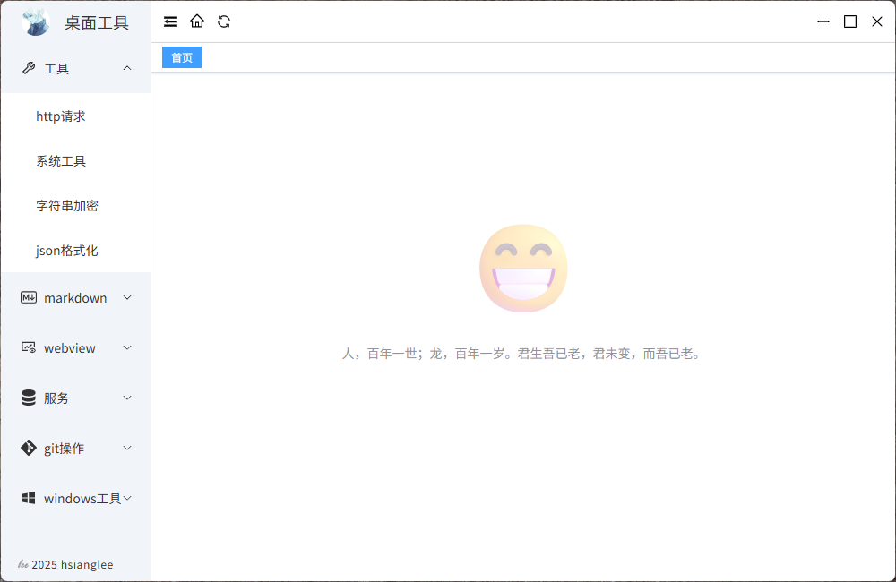

## 简介

使用vite + vue3 + typescript + electron编写的桌面管理工具，[下载地址](https://github.com/hsiangleev/desktool/releases)。

## 本地开发调试

```bash
# 克隆项目
git clone https://github.com/hsiangleev/desktool.git

# 进入项目目录
cd desktool

# 安装依赖
npm install

# 前端启动服务
npm run dev

# 后端启动服务
npm run electron:dev
```

## 打包

```bash
# 发布
npm run build
```

## 主界面样式

<p align="center">
  
</p>
